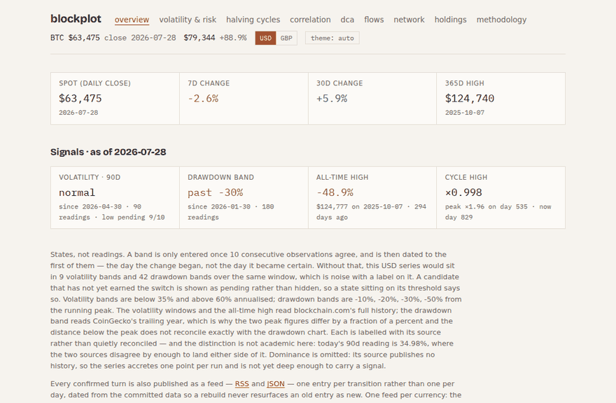

# blockplot

[](https://github.com/qasimmahmood95/blockplot/actions/workflows/ci.yml)
[](https://github.com/qasimmahmood95/blockplot/actions/workflows/lighthouse.yml)
[](https://github.com/qasimmahmood95/blockplot/actions/workflows/pipeline.yml)

Bitcoin financial analytics as a fully static site. A scheduled GitHub Actions
pipeline fetches market data, validates it with zod, derives every metric in
tested pure TypeScript, and commits versioned JSON to `/data`; Astro builds
the site from that dataset alone, charted with Observable Plot.



**Status:** Phase 1 (M0–M6) shipped; Phase 2 complete (M7–M14 shipped).
[PLAN.md](PLAN.md) holds the milestone plan, [CLAUDE.md](CLAUDE.md) the
development rules.

**Live:** https://qasimmahmood95.github.io/blockplot/

## Architecture

```
pipeline/   fetch → validate → transform scripts; metrics are pure, unit-tested functions
data/       versioned JSON committed by the pipeline workflow (github-actions[bot])
src/        Astro site; builds exclusively from /data
.github/    ci.yml (lint · typecheck · test · build), pipeline.yml (6 h cron + pipeline-code pushes), deploy.yml (Pages)
```

- **Static output only.** Every figure on the site is baked at build time from
  `/data`. Exactly two runtime fetches are sanctioned, and both render a
  committed value first and upgrade it on success: the header ticker (spot
  price) and the network page's fee tiers (which move on a ~10-minute
  timescale, so a 6-hourly snapshot would be stale on arrival).
- **The pipeline is the only writer of `/data`.** It runs 6-hourly (and on
  pushes that change pipeline code, so new datasets get seeded by the bot on
  the branch that introduces them), validates every source response and every
  on-disk dataset with zod, and commits as `github-actions[bot]`.
- **Charts are drawn at build time, not in the browser.** Each one's Plot
  options live in a single pure `spec` that the build and the browser share,
  rendered to SVG during the build and served in the HTML. Colours are
  `var(--token)`, so both themes and the theme toggle are CSS with no redraw,
  and the SVG carries a viewBox, so it scales without JavaScript. Plot itself
  — 88 KB gzipped — is fetched only on the interaction that needs it: a hover
  for the crosshair, a press for a scale or pair switch, an entered amount for
  the holdings line. Scroll past a chart and you never download it.
- **Client islands only where interactivity demands them**: the DCA simulator
  (which runs the pipeline's own fixture-tested functions in the browser), the
  live ticker, the fee tiers, and the holdings panel.
- **Reader-entered holdings stay in the browser.** The one piece of personal
  data the site accepts is written to `localStorage` and read back by the
  page. It is never transmitted — there is no server, account, or analytics
  to receive it.
- **Two display currencies, USD and GBP.** USD pages live at the root, GBP
  under `/gbp/`, with a header switcher that holds your place on the page.
  GBP is a re-denomination, not a relabelling — see below.
- **Hosting is swappable**: the deploy step is isolated in
  `.github/workflows/deploy.yml`.

### Data sources (all keyless)

| Source | Serves |
| ------ | ------ |
| CoinGecko | BTC daily closes (365d window), live spot, global mcap/dominance snapshot |
| blockchain.com charts | full BTC daily history from 2010 |
| FRED `fredgraph.csv` | S&P 500 daily closes |
| Yahoo Finance chart API | gold (XAU/USD spot, `GC=F` fallback), DXY (`DX-Y.NYB`, `DX=F` fallback) |
| DeFiLlama | total USD-pegged stablecoin circulating value, full history |
| mempool.space | recommended fee tiers (committed snapshot + the network page's live refresh) |
| FRED `DEXUSUK`, Yahoo `GBPUSD=X`, ECB via Frankfurter | GBP/USD daily rates, merged |

Historical BTC dominance has no keyless source, so `data/dominance.json`
accretes one snapshot per UTC day. Exchange netflow was dropped — no free
source exists. Sourcing decisions and dead ends are recorded in PLAN.md.

## Metric methodology

All maths lives in pure functions under `pipeline/`, unit-tested against
fixed fixtures with exact, independently derived expected values.

- **Returns** are daily log returns, `ln(Pₜ/Pₜ₋₁)`.
- **Realized volatility**: sample standard deviation (n−1) of daily log
  returns, annualized by √365 for BTC and √252 for market-hours assets,
  shown as a percentage. Rolling curves use the window of returns ending at
  each date and derive from the full-history series so even the 365d window
  is populated.
- **Drawdown**: daily close relative to the running peak; the deepest
  drawdown keeps the first trough date and the peak it fell from.
- **Sharpe / Sortino**: annualized, 0% risk-free rate; Sortino uses target
  downside deviation below 0% over all observations. Benchmarks keep their
  own trading calendars clamped to BTC's 365-day window, so figures are
  indicative rather than strictly like-for-like.
- **Correlation**: Pearson on pairwise-aligned daily log returns (shared
  trading days; a gap in either calendar becomes one multi-day return) over a
  trailing 90-calendar-day window; windows with fewer than 40 shared returns
  or zero variance emit nothing. Pairs containing BTC run about ten years —
  FRED publishes the S&P 500 as a rolling decade, and ten years is the deepest
  range Yahoo serves at daily granularity (it accepts `range=max` with
  `interval=1d` and then returns monthly bars, so responses are checked for
  daily spacing rather than trusted); the three inter-benchmark pairs keep 365
  days, since they exist only to fill the matrix.
- **Correlation regimes**: |corr| ≥ 0.25 reads as co-moving or inverse, inside
  that band as decoupled — but a threshold crossing is not a regime. The
  rolling curve oscillates, so a bare test reports dozens of one-day regimes
  around every crossing; a candidate must instead hold for 10 consecutive
  readings before it replaces the incumbent, and the boundary is dated at the
  *first* of those readings, since that is when the change began. The cost is
  stated on the page: the last 9 readings cannot yet start a regime, so a turn
  in the past fortnight shows as a continuation until the data earns it.
- **Halving cycles**: price divided by the halving-day close per epoch
  (blocks 210000/420000/630000/840000), plotted against days since halving.
- **DCA simulator**: fixed fee-inclusive buys at daily closes, month-end
  clamping, undeployed cash counted toward wealth so an equal-budget lump sum
  from the same start date compares like-for-like; ignores taxes, slippage,
  and yield on idle cash.
- **Holdings**: value at the latest committed close, profit and loss against
  the total entered — a simple return on money in, ignoring fees already
  paid, taxes, and anything since sold. A cost entered in the other currency
  is converted at the rate implied by the two latest closes (the same BTC
  priced in each), which is today's rate rather than the one paid. The
  history line holds the BTC amount constant, since the purchase dates are
  not known and inventing them would be worse than saying so.
- **GBP re-denomination**: each daily close is divided by *that day's*
  GBP/USD rate and every metric recomputed from the converted series — a
  GBP holder's drawdown, volatility and monthly returns genuinely differ
  from the USD ones, so converting the finished figures at today's rate
  would be wrong. Rates merge FRED `DEXUSUK` and Yahoo (both reach 1971,
  both publish with a lag) with ECB reference rates (from 1999, published
  every business day), later sources winning per date; each leg is
  optional and the file records which ones a run actually got. FX markets close
  at weekends and on bank holidays while BTC does not, so the last quote is
  carried forward; days before the first quoted rate are dropped rather
  than converted, and the pipeline warns if the rate tail lags BTC by more
  than 5 days. Converted closes are kept unrounded — a 2 dp round on a 2010
  sub-pound price is an error of up to 11% that would propagate into the
  monthly heatmap. The dollar index is never converted: it measures the
  dollar itself.

- **Signal states** are hysteretic. A volatility or drawdown band is only
  entered once 10 consecutive observations agree, and is then dated to the
  first of them — the day the change began, not the day it became certain. On
  the committed USD series a bare threshold test yields 9 volatility spans and
  42 drawdown spans in a year (GBP: 5 and 42, since its metrics are recomputed
  from converted closes); confirmation reduces them to 4. The page quotes its
  own tree's figure, computed in the pipeline rather than written down. A candidate that
  has not yet earned the switch is published as `pending` rather than hidden,
  so a state sitting on its threshold says so rather than flapping. The same
  machine drives the correlation regimes.

Rounding is applied at the serialization edge (2 dp percentages, 8 dp BTC,
4 dp multiples) and every page carries a methodology note for its own view.

## Feeds

Confirmed signal turns are published as RSS and JSON Feed, one entry per
transition rather than one per day:

- `/rss.xml` and `/feed.json` — USD
- `/gbp/rss.xml` and `/gbp/feed.json` — GBP

Two feeds because the states genuinely differ: GBP metrics are recomputed from
converted closes, so sterling's own volatility enters the band test. Entry
dates, ids and `lastBuildDate` all come from the committed data rather than
build time, so the six-hourly pipeline does not republish the whole feed as new
four times a day.

## Install and offline

The site is installable: a generated manifest scopes it to the deploy path, and
a service worker keeps the last committed dataset readable with no network.

The caching strategy is deliberately conservative, because the failure mode
matters more than the hit rate. Navigations are **network-first**, so a reader
who is online always sees the newest committed figures — a stale-while-
revalidate default would quietly serve figures from four refreshes ago with no
way to tell. Hashed build assets are cache-first, since their URL changes when
their content does. The two live fetches — the CoinGecko ticker and the
mempool.space fee tiers — are excluded outright: a cached "live" price is worse
than no live price, so offline they fall back to the committed close exactly as
they do on a failed request.

One consequence of drawing charts at build time: offline, every chart is fully
readable, because it is markup in the cached page. The crosshair is not, unless
Plot has been fetched at least once — it is only requested on a first hover, and
the worker caches what it has actually served. So a reader who installs the app,
goes offline and has never hovered a chart gets the charts and no tooltips. The
alternative is precaching 84 KB on every first visit for a feature most visits
never use, which is the cost this milestone existed to remove.

## Develop

```
npm ci
npm run dev        # local site
npm test           # pipeline unit tests (fixture-based, exact assertions)
npm run typecheck  # astro check, strict TS
npm run lint
npm run build
npm run pipeline   # refresh data/ locally (normally done by CI; do not commit the output)
```

## How this was built

This repo doubles as a public showcase of AI-assisted development, run
matter-of-factly: Claude Code working against the milestone plan in
[PLAN.md](PLAN.md) — one pull request per milestone from M1 on, in order
(M0 scaffolded directly). Every metric
landed with fixture tests asserting exact expected values derived
independently of the implementation; every PR was gated on an automated
code review, an independent test/verification pass that recomputed the
shipped datasets from raw data, and CI (lint, typecheck, tests, build)
before merging. Human review happens at PR boundaries. Data refreshes are
committed only by `github-actions[bot]`, keeping automation clearly
separated from authored work; source-availability dead ends (stooq's
bot-check, FRED's discontinued gold series, keyless dominance history) are
recorded in the plan rather than hidden. Process artifacts — the plan, the
rules, the PR descriptions — are part of the repo.
